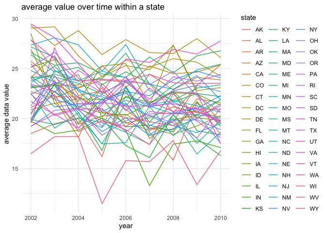

p8105_hw3_os2424
================
Ou Sha
2023-10-14

# Problem 1

``` r
data("instacart")
```

The dataset has 1384617 observations of 131209 unique users.  
There are 15 columns:  
`order_id`: order identifier  
`product_id`: product identifier  
`add_to_cart_order`: order in which each product was added to cart  
`reordered`: 1 - reorder; 0 - otherwise  
`user_id`: customer identifier  
`eval_set`: which evaluation set this order belongs in  
`order_number`: the order sequence number for this user (1=first,
n=nth)  
`order_dow`: the day of the week on which the order was placed  
`order_hour_of_day`: the hour of the day on which the order was placed  
`days_since_prior_order`: days since the last order, capped at 30, NA if
order_number=1  
`product_name`: name of the product, such as spring water, asparagus
etc.  
`aisle_id`: aisle identifier  
`department_id`: department identifier  
`aisle`: the name of the aisle, such as yogurt, cream etc  
`department`: the name of the department, such as produce, dairy eggs
etc.

``` r
# count aisles number
aisles <- instacart |>
  group_by(aisle)|>
  summarise(aisle_num = n())|>
  # order in ordered number to find most ordered aisles
  arrange(desc(aisle_num))
```

There are 134 aisles are there. The most ordered items are fresh
vegetables, 150609.  

``` r
aisles_plot <- aisles |>
  # filter aisles w/ more than 10000 items
  filter(aisle_num > 10000)|>
  # make plot
  ggplot(aes(reorder(aisle, aisle_num), aisle_num))+
  coord_flip()+
  geom_point(stat = "identity") + 
  labs(title = "Number of items ordered in each aisle",
       x = "aisles",
       y = "number of order") +
  theme_minimal()
aisles_plot
```

<!-- -->

``` r
ggsave("P1 Number of items ordered in each aisle.png", plot = last_plot())
```

    ## Saving 7 x 5 in image

Based on the plot, fresh vegetables and fresh fruits are significantly
the most popular aisles. Dairy products such as yogurt, milk, and cheese
have a higher number of order in general.

``` r
popular_aisle <- instacart|>
  # find items in these 3 aisles
  filter(aisle %in% c("baking ingredients", "dog food care", "packaged vegetables fruits"))|>
  group_by(aisle, product_name)|>
  summarise(order_num = n(), .groups = "keep")|>
  # order all the items in ordered number
  arrange(aisle, desc(order_num))|>
  group_by(aisle)|>
  # showing the three most popular
  slice_head(n=3)
popular_aisle
```

    ## # A tibble: 9 × 3
    ## # Groups:   aisle [3]
    ##   aisle                      product_name                              order_num
    ##   <chr>                      <chr>                                         <int>
    ## 1 baking ingredients         Light Brown Sugar                               499
    ## 2 baking ingredients         Pure Baking Soda                                387
    ## 3 baking ingredients         Cane Sugar                                      336
    ## 4 dog food care              Snack Sticks Chicken & Rice Recipe Dog T…        30
    ## 5 dog food care              Organix Chicken & Brown Rice Recipe              28
    ## 6 dog food care              Small Dog Biscuits                               26
    ## 7 packaged vegetables fruits Organic Baby Spinach                           9784
    ## 8 packaged vegetables fruits Organic Raspberries                            5546
    ## 9 packaged vegetables fruits Organic Blueberries                            4966

Based on the result, the top 3 popular items in baking ingredients are
`light brown sugar`, `pure baking soda`, and `cane sugar`. The top 3
popular items in dog food care are
`Snack Sticks Chicken & Rice Recipe Dog Treats`,
`Organix Chicken & Brown Rice Recipe`, and `Small Dog Biscuits`. The top
3 popular items in packaged vegetables fruits are
`Organic Baby Spinach`, `Organic Raspberries`, and
`Organic Blueberries`.

``` r
mean_hr <- instacart|>
  # find items 
  filter(product_name %in% c("Pink Lady Apples", "Coffee Ice Cream"))|>
  group_by(product_name, order_dow)|>
  # find the mean hour of the day
  summarise(mean_hour = mean(order_hour_of_day), .groups = "keep")|>
  arrange(order_dow)|>
  # make the 2*7 table
  spread(order_dow, mean_hour)
mean_hr
```

    ## # A tibble: 2 × 8
    ## # Groups:   product_name [2]
    ##   product_name       `0`   `1`   `2`   `3`   `4`   `5`   `6`
    ##   <chr>            <dbl> <dbl> <dbl> <dbl> <dbl> <dbl> <dbl>
    ## 1 Coffee Ice Cream  13.8  14.3  15.4  15.3  15.2  12.3  13.8
    ## 2 Pink Lady Apples  13.4  11.4  11.7  14.2  11.6  12.8  11.9

To make this table, we filter out the two aisles first and then
calculate the mean hour of day.  
Based on the result, the mean hour of the day at which coffee ice cream
is ordered is slightly larger than the mean hour of the dat at which
pink lady apples is ordered in general.

# Problem 2

``` r
# import and clean data
data("brfss_smart2010")
brfss <- brfss_smart2010|>
  janitor::clean_names()|>
  # format the data to use appropriate variable names
  rename(state = locationabbr, state_county = locationdesc)|>
  # focus on the “Overall Health” topic
  filter(topic == "Overall Health")|>
  # include only responses from “Excellent” to “Poor”
  filter(response %in% c("Excellent", "Very good", "Good", "Fair", "Poor"))|>
  # organize responses as a factor taking levels ordered from “Poor” to “Excellent”
  mutate(response = factor(response, levels=c("Poor", "Fair","Good","Very good","Excellent")))
```

``` r
# find states observed at 7 or more locations 2002
brfss_2002 <- brfss|>
  # filter 2002
  filter(year == 2002)|>
  group_by(state)|>
  # count number of locations
  summarise(loc_num = length(unique(state_county)))|>
  # filer 7 or more locations
  filter(loc_num >= 7)
```

In 2002, states CT, FL, MA, NC, NJ, PA were observed at 7 or more
locations.

``` r
# find states observed at 7 or more locations 2010
brfss_2010 <- brfss|>
  # filter 2002
  filter(year == 2010)|>
  group_by(state)|>
  # count number of locations
  summarise(loc_num = length(unique(state_county)))|>
  # filer 7 or more locations
  filter(loc_num >= 7)
```

In 2010, states CA, CO, FL, MA, MD, NC, NE, NJ, NY, OH, PA, SC, TX, WA
were observed at 7 or more locations.  
In 2002, 6 states were observed at 7 or more locations. In 2010, 14
states were observed at 7 or more locations. There are more states that
were observed at 7 or more locations in 2010.

``` r
# Construct a dataset that is limited to Excellent responses
brfss_ex <- brfss|>
  # filter excellent response
  filter(response == "Excellent")|>
  group_by(year, state)|>
  # average data_value
  summarise(avg_value = mean(data_value, na.rm = TRUE), .groups = "keep")|>
  # make spaghetti plot
  ggplot(aes(x = year, y = avg_value, group = state, color = state)) +
  geom_line() +
  labs(title = "average value over time within a state",
       x = "year",
       y = "average data value") +
  theme_minimal()
brfss_ex
```

<!-- -->
Based on the result, there is no obvious trend observed. The average
value over time within a state fluctuate.

``` r
# Make a two-panel plot showing, for the years 2006, and 2010, distribution of data_value for responses (“Poor” to “Excellent”) among locations in NY State
brfss_pl <- brfss|>
  # filter 2006 and 2010
  filter(year == 2006 | year == 2010)|>
  # filter ny state
  filter(state == "NY")|>
  # make plot 
  ggplot(aes(data_value, response))+
  facet_grid(~ year) +
  geom_density_ridges(scale=1)+
  labs(title = "distribution of data value for responses (“Poor” to “Excellent”) in NY")+
  theme_minimal()
brfss_pl
```

    ## Picking joint bandwidth of 2.1

    ## Picking joint bandwidth of 2.03

<!-- -->
Data value for reponses are similar in 2006 and 2010. Data value of
response “excellent”, “very good” increase slightly while the one of
response “poor” keeps the same and the one of “fair” decreases.

# Problem 3

``` r
# import data
covar <- read.csv("./data/nhanes_covar.csv",skip = 4,header = TRUE)
accel <- read.csv("./data/nhanes_accel.csv")
# clean data
covar <- covar|>
  # exclude participants less than 21
  filter(age>=21)|>
  # exclude participants with missing demographic data;
  na.omit()|>
  # encode data with reasonable variable classes 
  mutate(sex = if_else(sex==1, "male", "female"))|>
  mutate(education = case_when(education == 1 ~ "less than high school",
                               education == 2 ~ "high school equivalent",
                               education == 3 ~ "more than high school"))|>
  mutate(sex = factor(sex, levels= c("male", "female")))|>
  mutate(education = factor(education, levels = c("less than high school", "high school equivalent","more than high school")))
# merge data
merged <- inner_join(covar, accel, by = "SEQN")
merged <- merged|>
  janitor::clean_names()
# make it to a long format
merged_long <- pivot_longer(merged,
                            min1:min1440,
                            names_to = "time",
                            values_to = "mim")
```

``` r
# make table for the number of men and women in each education category
edu <- merged|>
  group_by(sex, education)|>
  summarise(num = n(), .groups = "keep")|>
  spread(sex, num)
edu
```

    ## # A tibble: 3 × 3
    ## # Groups:   education [3]
    ##   education               male female
    ##   <fct>                  <int>  <int>
    ## 1 less than high school     27     28
    ## 2 high school equivalent    35     23
    ## 3 more than high school     56     59

There are no significant differences between the numbers of males and
females at education level less than high school and more than high
school. When the education level is at high school equivalent, there are
more males at this level.

``` r
# create a visualization of the age distributions for men and women in each education category
age_edu <- merged|>
  ggplot(aes(x = age, y = education, fill = sex))+
  geom_density_ridges(scale = 0.5, alpha = 0.5)+
  labs(title = "age distributions for men and women in each education category")+
  theme_minimal()
age_edu
```

    ## Picking joint bandwidth of 8.03

<!-- -->
The age for men and women at education level of more than high school
are almost the same. There is no significant difference at this level.  
The age for men at education level of high school equivalent is smaller
than the one for women in general based on the plot (distribution plot
for female is left skewed).  
The age for men and women at education level of less than high school
are almost the same. There is no significant difference at this level.  

``` r
total_act <- merged_long|>
  group_by(seqn, sex, age, education)|>
  # create a total activity variable for each participant
  summarise(total= sum(mim), .groups = "keep")|>
  # plot activities
  ggplot(aes(x = age, y = total, color = sex))+
  geom_point(alpha = 0.5)+
  facet_grid(~ education) +
  # add trend line
  geom_smooth(se = FALSE) + 
  labs(title = "age distributions for men and women in each education category",
       y = "total activity")+
  theme_minimal()
total_act
```

    ## `geom_smooth()` using method = 'loess' and formula = 'y ~ x'

<!-- --> At
education level of high school equivalent and more than high school, the
total activity of female are larger than the ones of male among the ages
from 21 to 80. At education level of less than high school, the total
activity of male is smaller the one of female at ages from 20 to 45. For
ages from 45 to 80 at education level of less than high school, the
total activity of male is larger than the one of female.  
In general, the total activity of male and female follow similar
tendency at each different education levels.

``` r
# create a visualization of the age distributions for men and women in each education category
act_24 <- merged_long|>
  mutate(time = as.numeric(gsub("min", "", time)))|>
  arrange(time)|>
  ggplot(aes(x = time, y = mim, color = sex))+
  geom_point(alpha = 0.5)+
  facet_grid(~ education) +
  # add trend line
  geom_smooth(se = FALSE) + 
  labs(title = "24-hour activity time courses for each education level",
       y = "total activity")+
  theme_minimal()
act_24
```

    ## `geom_smooth()` using method = 'gam' and formula = 'y ~ s(x, bs = "cs")'

<!-- -->
Based on the plot, the smooth line of 24-hr activity for male and female
are almost the same among the three education levels. The tendency among
the three education levels are similar. Based on the plot, there is no
significant differences among 24hr total activity for male and female in
general.
